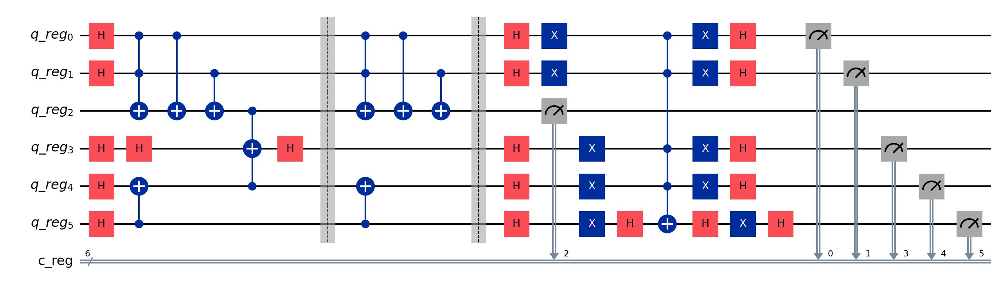

# Bb84 algorithm
## Description
This is a quantum algorithm that uses BB84 protocol to create a secure quantum key distribution between two parties. The algorithm is implemented in Qiskit and uses the IBM Quantum Experience to run the quantum circuits.


## Env

```dotenv
IBM_TOKEN="token_ibm"
IBM_NAME="name"
```