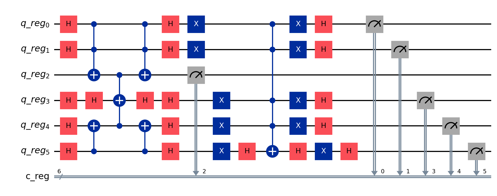

# Condition2 algorithm
## Description
We have condition ((y ^ x) && (i && j)) and we wanna get all conditions with result true (you can get also count of results). We can use something like grover algorithm.

## Env

```dotenv
IBM_TOKEN="token_ibm"
IBM_NAME="name"
```