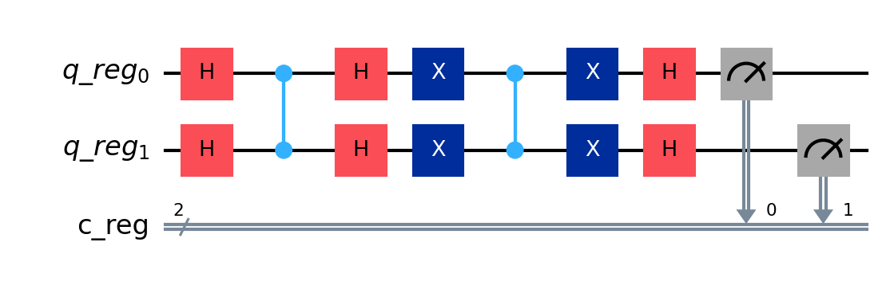

# Grover algorithm
## Description
This is a quantum algorithm that uses Grover's algorithm to search for a target state in a quantum database. The algorithm is implemented in Qiskit and uses the IBM Quantum Experience to run the quantum circuits.<br>

## Env

```dotenv
IBM_TOKEN="token_ibm"
IBM_NAME="name"
```