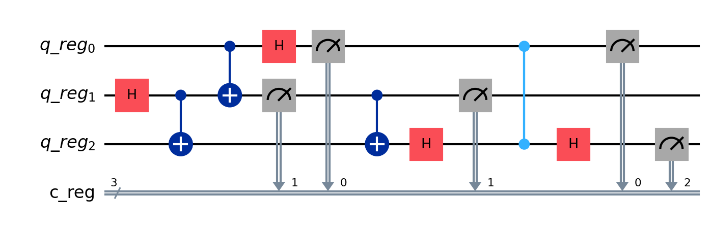

# Quantum teleportation algorithm
## Description
This is a simple quantum circuit that creates a quantum teleportation of a qubit (our example is 3).

## Env

```dotenv
IBM_TOKEN="token_ibm"
IBM_NAME="name"
```